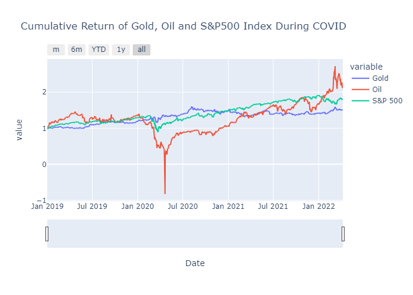

# World Events Effect on Gold, Oil and the S&P 500 Index

## Proposal
The aim of this project is to undertake a quantitative analysis of Gold, Oil and the S&P 500 Index trends from previous years and determine how they are affected by world events.

Specifically, we will be looking at the following:
* 911
* GCF
* COVID-19
* Ukraine Russia War

Using the knowledge obtained in Monash Fintech Bootcamp the group, Andrew, Alex, Vinay, Abdul and Jack, will read, clean, and analyse Gold, Oil and the S&P 500 Index data during these periods.

### Questions
* What are the trends of Gold, Oil and the S&P 500 Index in relation to man-made disasters? (GFC, 911)
* What are the trends of Gold, Oil and the S&P 500 Index in relation to natural disasters? (GFC, 911)
* What are the potential long-term effects of war from the analysis of previous war data? (Afganistan, Iraq Wars)
* What are the current short-term effects of war? (Ukraine Russia War)

### Sources of Data

For this analysis our group sourced data from the yFinance python library.
yFinance is an open-source tool that uses Yahoo Finance's publicly avaliable API to provide financial data.

* [Gold, Oil and the S&P 500 Index Data](https://pypi.org/project/yfinance/)

# Analysis
## 911

## GFC

## COVID

Cumulative Return             |  Volatility
:-------------------------:|:-------------------------:
   |  

According to the World Health Organisation (WHO), the initial case of COVID-19 was reported in Wuhan, China, December, 2019. 
The above graphs displays the cumulative return and volatility during the COVID-19 pandemic period and assists in understanding the impact COVID-19 had on Gold, Oil and the S&P 500 Index.

### **Oil**
The above volatility graph tells us that Oil violitility (Red) and price movements (Red) have been very significant in 2020, especially around the Covid-19 timeline. 
Reasoning behind this initial decrease in Oil price can be explained by the worldwide demand for oil rapidly falling as Governments close businesses and restrict travel due to the COVID-19 pandemic. Additionally during this big spike in volatility. An oil price war occured between Saudi Arabia and Russia after the two countries failed to agree on oil production levels. 

A notable event for oil during this period was on April 20, 2020, when the price of crude oil dropped 306% or $55.90 to settle at negative $37.63 a barrel. This significant plunge was the largest drop in oil price since 1983. There are multiple factors contributing to this drop in price however the main factor was the oversupply of crude oil due to the worldwide lockdowns of COVID-19. The oversupply of oil was so extreme it triggered a storage crisis which therefore triggered a halt in drilling and refining, becasuse there was nowhere fore the oil to go.

Throughout the remainder of the COVID period oil remained more volatile than Gold and the S&P 500 as depicted by increased movement in the volatility plot above.

### **Gold**

In previous events gold is considered a "safe haven" when stock prices begin to decrease. In relation to COVID-19 gold has continued to play its role as a hedge against uncertainty, rising around 28% from January 1 to August 14, 2020 reaching a maximum price of $2051.50 USD. Although the price of gold plunged below $1500, when the most acute part of the global stock market plunge occured and investors began to panic, the drop of gold was relatively mild

The above plot measures the change in variance in the returns over a specific period of time. The volatility is calculated by taking a rolling window standard deviation on the % change.

We note from this plot that the volatility of Oil price has increased significantly over the COVID-19 period compared to Gold and the S&P 500 Index.

