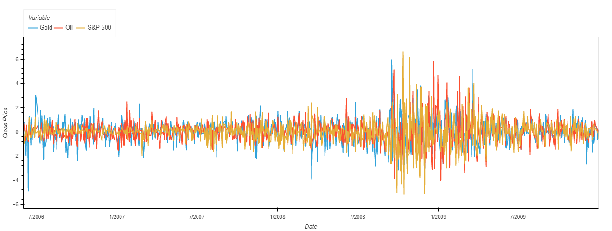

# World Events Effect on Gold, Oil and the S&P 500 Index

## Proposal
The aim of this project is to undertake a quantitative analysis of Gold, Oil and the S&P 500 Index trends from previous years and determine how they are affected by world events.

Specifically, we will be looking at the following:
* 911
* GCF
* COVID-19
* Ukraine/Russia War and Afghan war

Used a previous war as a point of reference for the short term effects of war on variables like the S&P500, Gold and Oil

Using the knowledge obtained in Monash Fintech Bootcamp the group, Andrew, Alex, Vinay, Abdul and Jack, will read, clean, and analyse Gold, Oil and the S&P 500 Index data during these periods.

### Questions
* What are the trends of Gold, Oil and the S&P 500 Index in relation to man-made disasters? (GFC, 911)
* What are the trends of Gold, Oil and the S&P 500 Index in relation to natural disasters? (COVID-19)
* What are the potential long-term effects of war from the analysis of previous war data? (Afganistan, Iraq Wars)
* What are the current short-term effects of war? (Ukraine Russia War)

### Sources of Data

For this analysis our group sourced data from the yFinance python library.
yFinance is an open-source tool that uses Yahoo Finance's publicly avaliable API to provide financial data.

* [Gold, Oil and the S&P 500 Index Data](https://pypi.org/project/yfinance/)

# Analysis
## 911 and Ukraine & Russian War
used previous wars as a point of reference to do an analysis of what happens to world's oil price, gold and s&p 500. Try to use this analysis to understand what is happening during the Ukraine and Russia conflict. 

- The terrorist attack on Sept. 11, 2001 was marked by a sharp plunge in the stock market, causing a $1.4 trillion loss in market value.
- The first week of trading after the attacks saw the S&P 500 fall more than 14%, while gold and oil rallied.
- The fallout from Sept. 11 may weigh on the U.S. economy and taxpayers for decades to come after spending trillions of dollars on the wars in Iraq and Afghanistan.

### Gold 

- As wall street closed for a week, investors looked for safer alternatuves in terms of investments.
- Gold provided a safe haven initially which spike the price of gold as investors saw an opportunity
- As visioned on the graph, Gold rose and held its position for about a month before decreasing to its previous price before the 9/11 attacks 

### Oil

- A bit similar to gold, oil's price rose quite quickly and suddenly
- This was primarly due to fear among investors as they anticipated a price increase due to the shortage they may arise from middle eastern countries

### S&P 500

- As stated before, the S&P index fell more than 14% during the first week after the attacks
- the NYSE and the Nasdaq remained closed until September 17
- Many big financial firms were affected due to their offices being within the World trade centre

## Global Financial Crisis (Great Recesion)

*Period of extreme stress in global financial markets (Time Period = Mid 2007 to early 2009), since World War II.*

Oil vs Gold            |S&P 500 vs Gold            |  S&P 500 vs Oil
:-------------------------:|:-------------------------:|:-------------------------:
||

### S&P 500

- S&P 500 fell 46.13% from October 2007 to March 2009 but recovered all of its losses by March 2013. The decline was the largest drop in the S&P index since World War II.
- Much of the decline in the United States occurred in the brief period around the climax of the crisis in the fall of 2008. From its local peak of 1,300.68 on August 28, 2008, the S&P 500 fell 48 percent in a little over six months to its low on March 9, 2009.

### Oil

- The crude oil market fluctuated enormously around the financial crisis.
- Oil prices fell from a high of $133.88 in June 2008 to a low of $39.09 in February 2009.
- Volatility of the crude oil market increased sharply during the GFC period, whereas it remained at a similar level with a couple of volatility clusters before and after.
- Before the GFC period, the S&P 500 and oil prices moved opposite and then together after the GFC. This implies that the volatility change of the oil market is similar to that of the overall financial markets owing to the financialization of the crude oil market. 

### Gold

- Historically the value of gold is sometimes initially pulled down at the start of a recession, however, it is realistic to expect that in most cases it will bounce back, and increase in value throughout the recession.
- Gold is perceived as a safe-haven asset and investors buy gold as a hedging instrument (Singhal et al., 2019). Further, gold helps investors diversify their portfolios, thereby minimizing macroeconomic risk.
- During the GFC, we only find short memory in the gold market and only on one occasion, where Dubai experienced a lagged distortion of gold prices.
- While most of the commodity prices declined after the 2008 financial crisis, the price of gold continued to increase and never seemed to decline.

**Unexpected shock on the economy can have negative spillover effects on the commodity markets: not only increasing market volatility but also worsening market efficiency and long-term market equilibrium. No long term relationships exist between gold and oil prices. Changes to gold prices by oil prices are time and event dependnt.**

## COVID

Cumulative Return             |  Volatility
:-------------------------:|:-------------------------:
   |  

According to the World Health Organisation (WHO), the initial case of COVID-19 was reported in Wuhan, China, December, 2019. 
The above graphs displays the cumulative return and volatility during the COVID-19 pandemic period and assists in understanding the impact COVID-19 had on Gold, Oil and the S&P 500 Index. 

The Volatility chart measures the change in variance in the returns from Jan 2019 to Date. The volatility is calculated by taking a rolling window standard deviation on the % change.

### **Oil**
The above volatility graph tells us that Oil violitility (Red) and price movements (Red) have been very significant in 2020, especially around the Covid-19 timeline. 
Reasoning behind this initial decrease in Oil price can be explained by the worldwide demand for oil rapidly falling as Governments close businesses and restrict travel due to the COVID-19 pandemic. Additionally during this big spike in volatility. An oil price war occured between Saudi Arabia and Russia after the two countries failed to agree on oil production levels. 

A notable event for oil during this period was on April 20, 2020, when the price of crude oil dropped 306% or $55.90 to settle at negative $37.63 a barrel. This significant plunge was the largest drop in oil price since 1983. There are multiple factors contributing to this drop in price however the main factor was the oversupply of crude oil due to the worldwide lockdowns of COVID-19. The oversupply of oil was so extreme it triggered a storage crisis which therefore triggered a halt in drilling and refining, becasuse there was nowhere fore the oil to go.

Throughout the remainder of the COVID period oil remained more volatile than Gold and the S&P 500 as depicted by increased movement in the volatility plot above.

### **Gold**

In previous events gold is considered a "safe haven" when stock prices begin to decrease. In relation to COVID-19 gold has continued to play its role as a hedge against uncertainty, rising around 28% from January 1 to August 14, 2020 reaching a maximum price of $2051.50 USD. Although the price of gold plunged below $1500, when the most acute part of the global stock market plunge occured and investors began to panic, the drop of gold was relatively mild compared to the S&P 500 Index and Oil prices. The rapid spread of coronavirus and implementation of economic lockdowns pushed gold prices to above $2000.

The volatily of Gold prices depicted by the volatility chart above are very minimal as the price of gold has been relatively stable throughout the COVID-19 pandemic.

### **S&P 500 Index**
The first half of 2020 saw a dramatic stock market crash as a result of COVID-19. Many countries imposed stricked lockdowns to contan the further spread of the virus and halted all major economic operations, ultimately leading to a negative impact to stock markets. By 20 March, 2020, the S&P 500 Index had fallen a total of 30% from its peak.

Although the market crash was dramatic, it didn't last. The stock marker experienced a surprising recovery, even as many areas of economies globally continued to experience trouble. This turn in tide occured around mid April as Governments began responding with record stimulus packages. By September 2020 the S&P500 index had recovered to its peak of $3,380 and continued to rise, reaching a record high of $4766 at the end of 2021. This potrays investors restoration of confidencen in the stock market and the recovery of economies worldwide. 